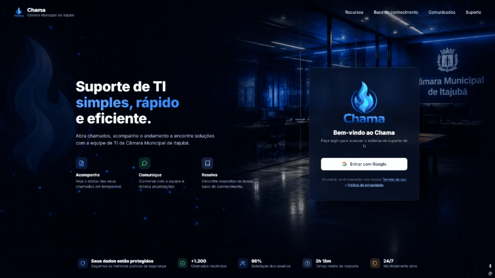

<!-- ▓▓▓▓▓▓▓▓▓▓▓▓▓▓▓▓▓▓▓   Inicio   ▓▓▓▓▓▓▓▓▓▓▓▓▓▓▓▓▓▓▓ -->

<!-- Badges row -->

&ensp;

&ensp;

&nbsp;

&ensp;

&ensp;

&ensp;

&ensp;

&nbsp;

&nbsp;

<!-- ▓▓▓▓▓▓▓▓▓▓▓▓▓▓▓▓▓▓▓   Tech Stack   ▓▓▓▓▓▓▓▓▓▓▓▓▓▓▓▓▓▓▓ -->

### Tech Stack

*As tecnologias que utilizo para projetar, desenvolver e entregar software.*

&nbsp;

**`// FRONTEND`**

&nbsp;

**`// BACKEND`**

&nbsp;

**`// DATA & INFRASTRUCTURE`**

&nbsp;

**`// TOOLS & WORKFLOW`**

&nbsp;

&nbsp;

<!-- ▓▓▓▓▓▓▓▓▓▓▓▓▓▓▓▓▓▓▓   Projetos   ▓▓▓▓▓▓▓▓▓▓▓▓▓▓▓▓▓▓▓ -->

## Meus Projetos

*Experimentos, produtos e jogos desenvolvidos por mim do conceito até a implementação.*

&nbsp;

## 🏆 CS Major Manager

### *A experiência definitiva de draft-roguelike no cenário competitivo de Counter-Strike*

Gerencie uma organização de esports, monte elencos, descubra talentos, desenvolva estratégias, dispute campeonatos e conduza sua equipe até a conquista de um Major.

&nbsp;

&nbsp;

&nbsp;

<table>
<tr>
<td width="33%" align="center">

### 🧠 Estratégia

Sistema de veto de mapas, definição de táticas, gerenciamento de economia e tomada de decisões competitivas.

</td>

<td width="33%" align="center">

### 👥 Gestão de Elenco

Contrate jogadores, monte lineups, desenvolva talentos e construa projetos vencedores.

</td>

<td width="33%" align="center">

### 🏅 Jornada do Major

Participe de campeonatos, supere adversários e busque o título mais prestigiado do cenário.

</td>

</tr>
</table>

&nbsp;

&nbsp;

  
## 🎫 Chama
 
### *Sistema de gestão de chamados de TI para Câmaras Municipais de médio e pequeno porte*
 
Abertura, acompanhamento e resolução de chamados de suporte técnico com histórico auditável, dashboard administrativo e relatórios exportáveis em PDF — login corporativo via Google Workspace OAuth.
 
&nbsp;

&nbsp;

&nbsp;
 
<table>
<tr>
<td width="33%" align="center">
  
### 🎟️ Chamados
 
Abertura com categoria, prioridade e anexos, linha do tempo com histórico completo de status e comentários.
 
</td>
<td width="33%" align="center">
  
### 📊 Dashboard
 
Painel administrativo com totais em tempo real, tempo médio de atendimento e distribuição por técnico.
 
</td>
<td width="33%" align="center">
  
### 📄 Relatórios
 
Chamados por mês, categoria, setor e técnico, exportáveis em PDF direto pela interface.
 
</td>
</tr>
</table>

&nbsp;

<!-- ▓▓▓▓▓▓▓▓▓▓▓▓▓▓▓▓▓▓▓   X. THE DIMENSION — 3D   ▓▓▓▓▓▓▓▓▓▓▓▓▓▓▓▓▓▓▓ -->

### Render 3D

*Cada pico é resultado de semanas de dedicação intensa. Cada vale é uma semente em fase de crescimento.*

&nbsp;

&nbsp;

Auto-generated nightly by the <code>3d-contrib.yml</code> GitHub Action

&nbsp;

